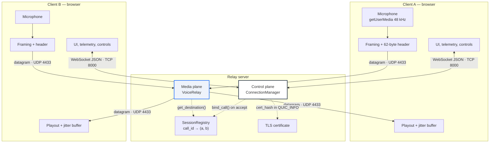
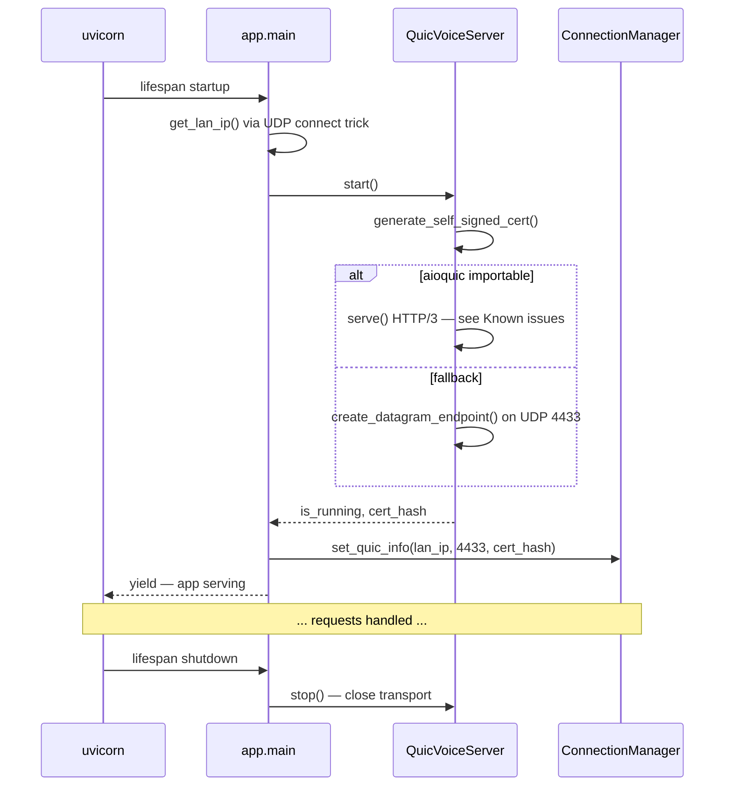
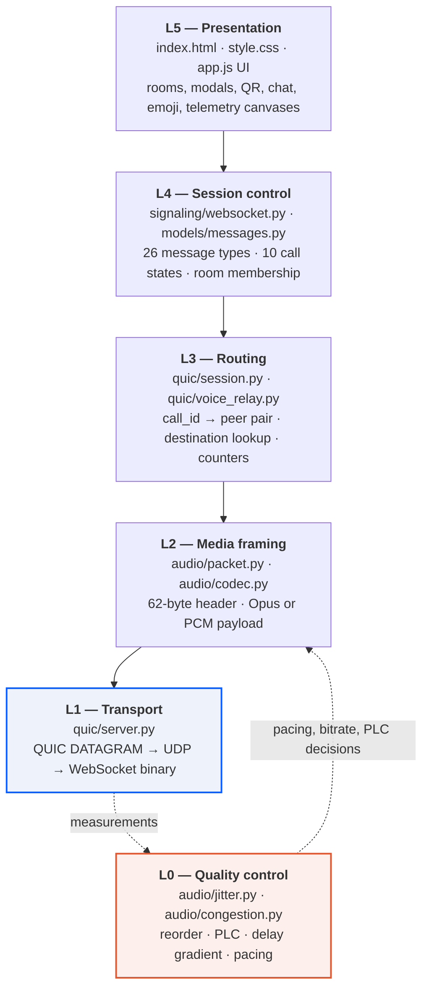
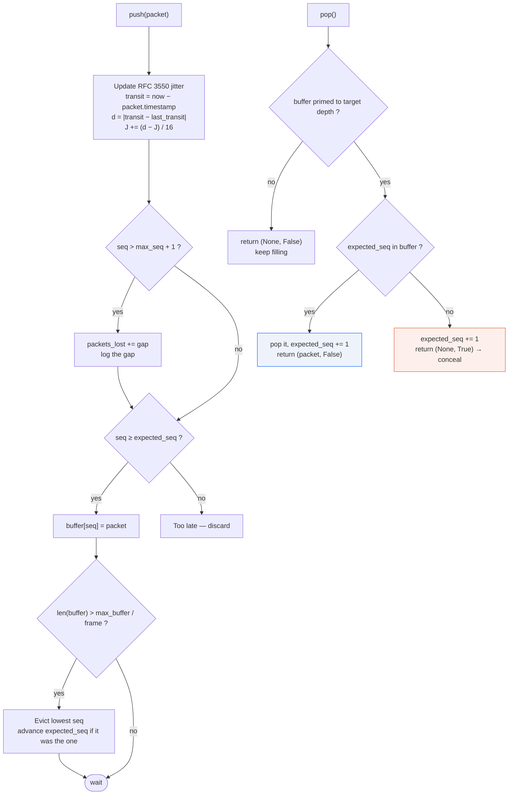
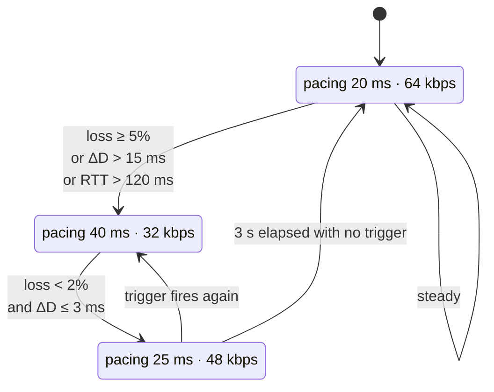
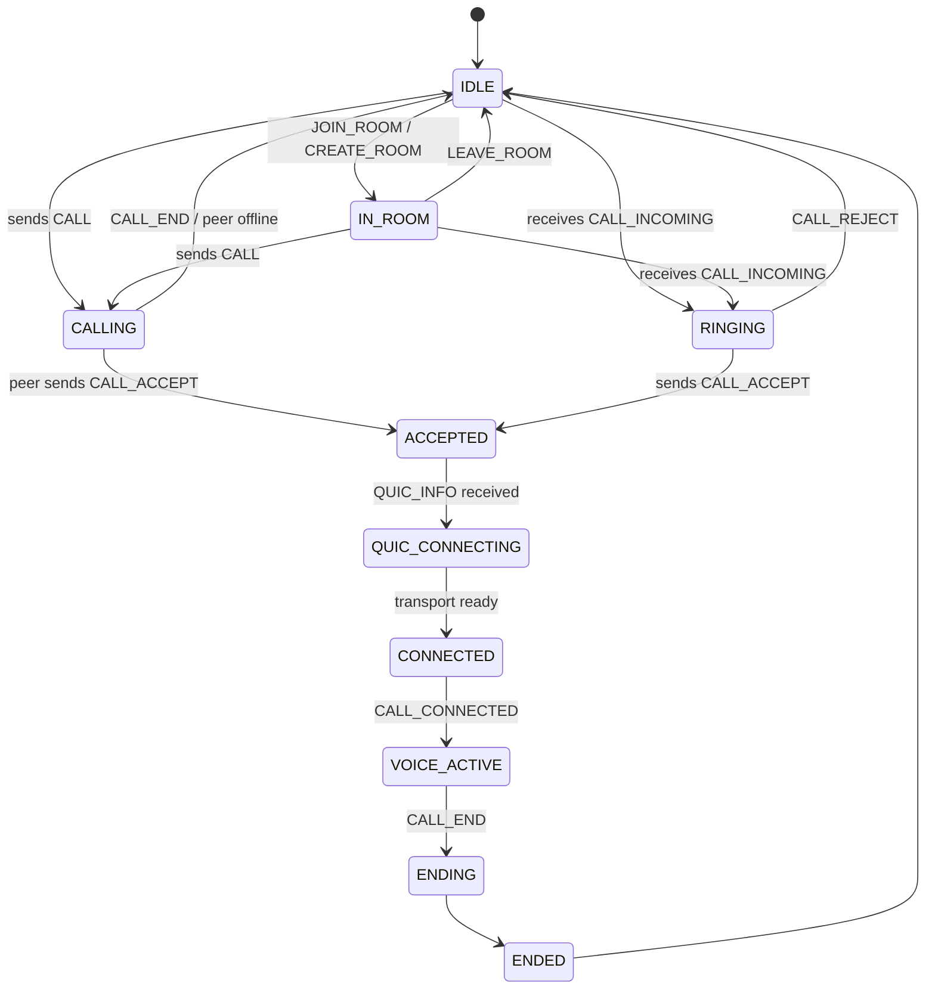
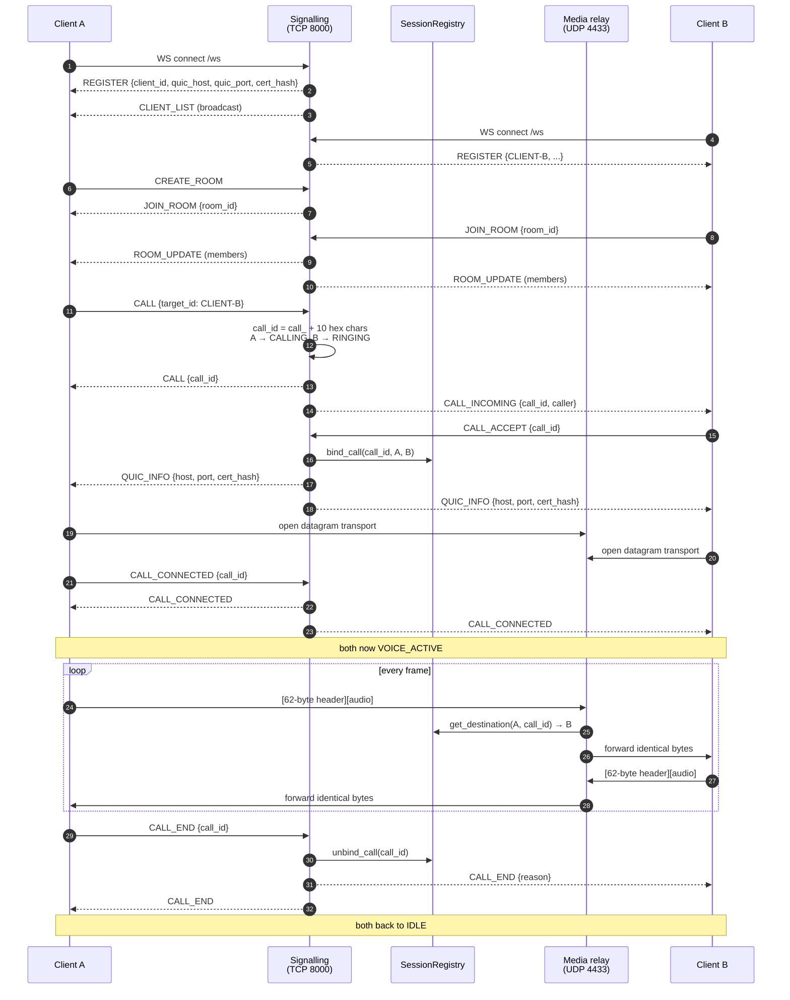
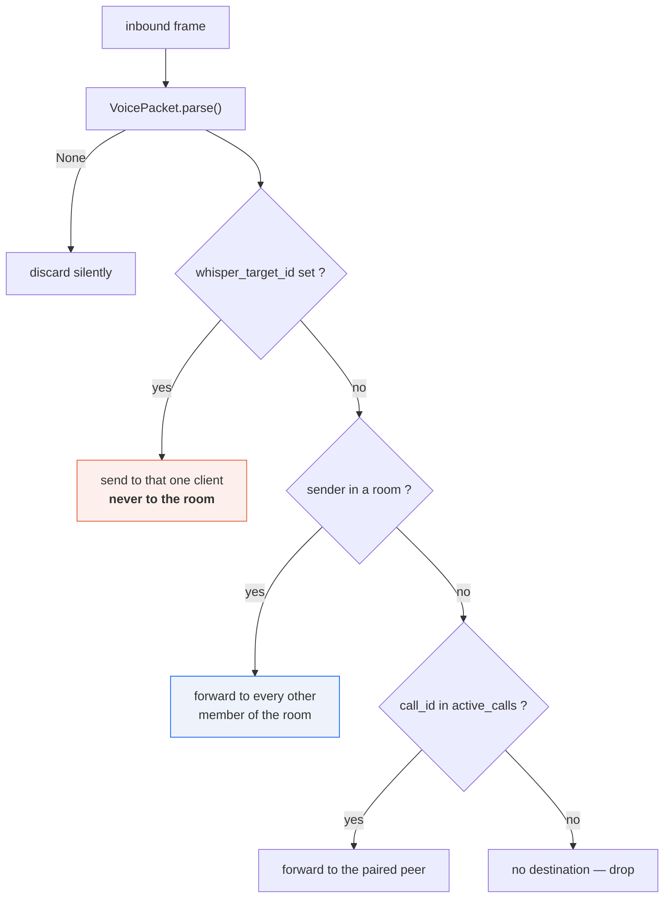
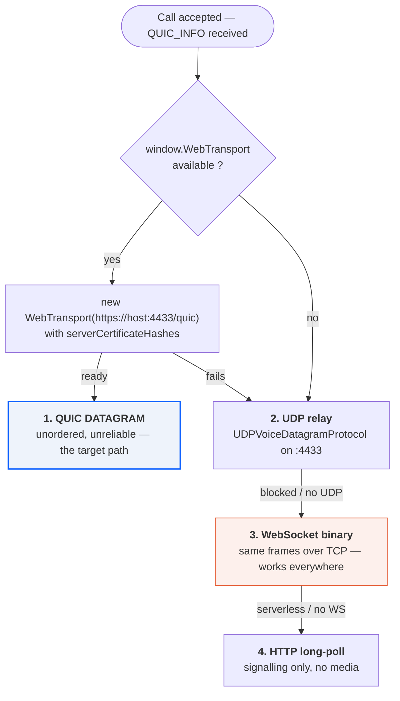
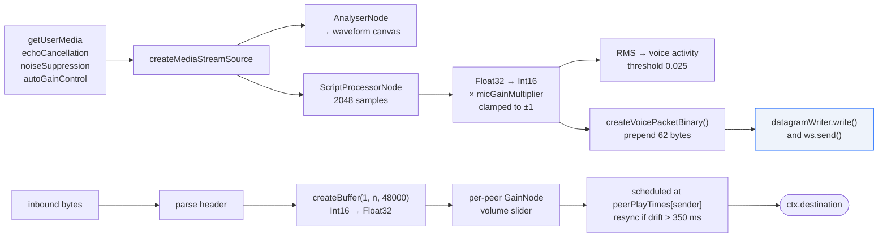

# VoQuic


url: https://vo-quic.vercel.app/
**Real-time voice over QUIC unreliable datagrams.** A FastAPI signalling server, a header-only media relay, and a browser client that frames microphone audio itself — built to prove that conversational latency stays flat under packet loss when the transport stops guaranteeing order.

Internally the running system identifies itself as **Pulse Relay**; `VoQuic` is the repository name. The two refer to the same thing.

```
Status: working prototype. Signalling, rooms, calls, whisper routing and telemetry
        are complete. The QUIC datagram path is wired but not yet the default media
        route — see "Known issues" before deploying anything.
```

---

## Table of contents

1. [Why this exists](#1-why-this-exists)
2. [Quick start](#2-quick-start)
3. [Repository map](#3-repository-map)
4. [Top-level architecture](#4-top-level-architecture)
5. [Runtime topology and ports](#5-runtime-topology-and-ports)
6. [The layer stack, top to bottom](#6-the-layer-stack-top-to-bottom)
7. [Low level: the wire format](#7-low-level-the-wire-format)
8. [Low level: the jitter buffer](#8-low-level-the-jitter-buffer)
9. [Low level: the congestion controller](#9-low-level-the-congestion-controller)
10. [Mid level: signalling protocol](#10-mid-level-signalling-protocol)
11. [Mid level: call lifecycle](#11-mid-level-call-lifecycle)
12. [Mid level: routing and the whisper channel](#12-mid-level-routing-and-the-whisper-channel)
13. [Transport selection and fallbacks](#13-transport-selection-and-fallbacks)
14. [Browser audio pipeline](#14-browser-audio-pipeline)
15. [Certificates and TLS](#15-certificates-and-tls)
16. [HTTP and WebSocket API reference](#16-http-and-websocket-api-reference)
17. [Module reference](#17-module-reference)
18. [Configuration](#18-configuration)
19. [Native CLI client](#19-native-cli-client)
20. [Testing](#20-testing)
21. [Known issues](#21-known-issues)
22. [Roadmap](#22-roadmap)

---

## 1. Why this exists

TCP promises that byte *n* arrives after byte *n−1*. For a file transfer that promise is the entire product. For speech it is a liability.

When a TCP segment is lost, every segment behind it sits in the receiver's kernel buffer until the retransmission arrives. This is **head-of-line blocking**. The audio the listener is waiting for has already reached their machine; the transport simply will not hand it over. One lost packet on a 40 ms link becomes roughly 300 ms of silence followed by a burst of stale speech — and the jitter buffer grows to absorb the burst, so latency never returns to its original baseline.

A 20 ms speech frame is worthless roughly 20 ms after it was captured. Delivering it late is worse than never delivering it, because late delivery permanently costs buffer depth.

QUIC's DATAGRAM extension (RFC 9221) carries application data inside a TLS 1.3–secured QUIC connection (RFC 9000) **without** retransmission or ordering. Encrypted like TCP, ordered like nothing. VoQuic is built on that trade:

| Under loss | Ordered stream | VoQuic |
|---|---|---|
| One frame lost | Everything behind it waits for the retransmit | Concealed by the receiver, next frame plays on time |
| Latency after a burst | Buffer grows and stays grown | Returns to baseline when the burst ends |
| Congestion response | Reacts once loss is already happening | Reacts to rising delay, before the queue fills |
| Server cost per leg | Decode, mix, re-encode | Parse 62 bytes, look up, forward |

---

## 2. Quick start

```bash
git clone https://github.com/sripad2020/VoQuic.git
cd VoQuic

python -m venv .venv
source .venv/bin/activate        # Windows: .venv\Scripts\activate

pip install -r requirements.txt
pip install cryptography websockets   # see "Known issues" — not yet in requirements.txt

python run.py                    # HTTP  on :8000, UDP media on :4433
python run.py --ssl              # HTTPS on :8443 instead
```

Open `http://localhost:8000` in two browser tabs, or `http://<YOUR_LAN_IP>:8000` on two devices on the same network. Create a room in one, join it by ID in the other, then start the call.

> **Microphone access on other devices.** Browsers only expose `getUserMedia` on a secure origin. `localhost` counts as secure; a bare LAN IP over HTTP does not. To call between phones and laptops, run `python run.py --ssl` and accept the self-signed certificate warning on each device (*Advanced → Proceed*).

**Optional native codec.** Without `opuslib` the pipeline silently falls back to raw PCM passthrough — functional, but roughly 768 kbps per stream instead of ~32–64 kbps:

```bash
pip install opuslib    # requires libopus on the system
```

---

## 3. Repository map

```
VoQuic/
├── run.py                       entry point; SSL flag, banner, uvicorn launch
├── client.py                    native Python CLI client (no browser)
├── requirements.txt
│
├── app/
│   ├── main.py                  FastAPI app, lifespan, routes, WebSocket endpoint
│   │
│   ├── models/
│   │   └── messages.py          MessageType, CallState, SignalMessage (pydantic)
│   │
│   ├── signaling/
│   │   └── websocket.py         ConnectionManager — rooms, calls, state, fan-out
│   │
│   ├── quic/
│   │   ├── server.py            cert generation, aioquic attempt, UDP fallback
│   │   ├── session.py           VoiceSession + SessionRegistry (call pairing)
│   │   └── voice_relay.py       header-only datagram forwarding
│   │
│   ├── audio/
│   │   ├── packet.py            62-byte frame header: pack / parse
│   │   ├── codec.py             Opus wrapper with PCM passthrough fallback
│   │   ├── jitter.py            reorder buffer, RFC 3550 jitter, PLC trigger
│   │   └── congestion.py        delay-gradient (GCC-style) controller
│   │
│   └── static/
│       ├── index.html           single-page UI
│       ├── style.css
│       └── app.js               ~1.9k lines: capture, framing, transport, playout
│
└── tests/
    ├── test_protocol.py         packet round-trip, jitter buffer, codec
    └── syntax_check.py
```

---

## 4. Top-level architecture

Two planes that share nothing but a call ID. Signalling must be reliable and ordered, so it runs over TCP. Media must be neither, so it runs over UDP.



The critical property: **the media plane never decodes audio.** `VoiceRelay.process_datagram()` parses 62 header bytes, resolves the destination, and forwards the identical byte string. Adding a participant costs a dictionary entry, not a codec instance.

---

## 5. Runtime topology and ports

| Port | Protocol | Bound by | Carries |
|---|---|---|---|
| `8000` | TCP | uvicorn | Static UI, `/health`, `/api/*`, WebSocket `/ws` |
| `8443` | TCP | uvicorn (`--ssl`) | Same, over TLS — needed for mic access off `localhost` |
| `4433` | UDP | `QuicVoiceServer` | QUIC / raw UDP voice datagrams |

Startup order, from `app/main.py` `lifespan()`:



`get_lan_ip()` opens a UDP socket to `10.255.255.255:1` and reads back the local socket name. No packet is ever sent; it just makes the OS pick an outbound interface. Falls back to `127.0.0.1`.

---

## 6. The layer stack, top to bottom



Each layer is addressed in its own section below, starting at the bottom.

---

## 7. Low level: the wire format

Defined in `app/audio/packet.py`, mirrored byte-for-byte in `createVoicePacketBinary()` in `app/static/app.js`.

```python
HEADER_FORMAT = "!B16s16s16sIQB"      # network byte order, no padding
HEADER_SIZE   = 62
```

```
 byte  0        1                17                33          49      53     61   62
       ┌────────┬────────────────┬────────────────┬────────────┬──────┬──────┬────┬──────────…
       │  ver   │    call_id     │   sender_id    │ whisper_id │ seq  │  ts  │cdc │  payload
       │ uint8  │  16 B ASCII    │  16 B ASCII    │ 16 B ASCII │ u32  │ u64  │u8  │  N bytes
       └────────┴────────────────┴────────────────┴────────────┴──────┴──────┴────┴──────────…
        1 byte       16 bytes         16 bytes        16 bytes    4 B    8 B   1 B
       └──────────────────────── 62-byte header, big-endian ─────────────────────┘
```

| Offset | Size | Field | Type | Notes |
|---|---|---|---|---|
| 0 | 1 | `version` | `uint8` | Always `1` |
| 1 | 16 | `call_id` | ASCII | Null-padded, truncated at 16. Format `call_<10 hex>` = 15 chars, fits exactly |
| 17 | 16 | `sender_id` | ASCII | Null-padded, e.g. `CLIENT-A` |
| 33 | 16 | `whisper_target_id` | ASCII | Empty = normal routing; set = private sub-channel |
| 49 | 4 | `sequence` | `uint32` BE | Monotonic per sender; drives reordering and loss detection |
| 53 | 8 | `timestamp` | `uint64` BE | Unix ms at capture; drives the jitter calculation |
| 61 | 1 | `codec` | `uint8` | `0x01` Opus, `0x02` PCM |
| 62 | N | `payload` | bytes | Never inspected by the relay |

**Header is big-endian; the PCM payload is little-endian.** The JavaScript writer uses `DataView.setUint32(…, false)` for header fields, but the payload comes straight from an `Int16Array` buffer, which is little-endian on every platform the app runs on. The reader matches (`getInt16(i*2, true)`), so it is internally consistent — but it is an undocumented asymmetry worth knowing before writing a third-party client.

Round-trip, from `tests/test_protocol.py`:

```python
pkt = create_voice_packet(
    call_id="call_test123", sender_id="CLIENT-A",
    sequence=1050, payload=b"\x01\x02...", whisper_target_id="CLIENT-B",
)
raw    = pkt.serialize()          # 62 + len(payload)
parsed = VoicePacket.parse(raw)   # None if len < 62 or unpack fails
```

`parse()` never raises — it returns `None` on any malformed input, so a hostile datagram cannot take down the relay loop.

---

## 8. Low level: the jitter buffer

`app/audio/jitter.py`. Defaults: `min=20 ms`, `target=40 ms`, `max=100 ms`, `frame=20 ms` — so the buffer holds 1–5 frames and aims for 2.



The second element of the `pop()` tuple is the whole point. `(None, False)` means *nothing ready yet, wait*. `(None, True)` means *that frame is gone, synthesise a replacement and move on* — the caller invokes `OpusCodec.decode(None)`, which runs Opus PLC when native bindings are present and emits 20 ms of silence when they are not.

Jitter uses the RFC 3550 smoothing constant of 1/16, which is the same estimator RTP uses, so the number is directly comparable to figures from any RTP monitoring tool.

`get_telemetry()` returns `jitter_ms`, `packet_loss_pct`, `packets_rx`, `packets_lost`, `buffer_depth_ms`.

---

## 9. Low level: the congestion controller

`app/audio/congestion.py`. This watches the *trend* in one-way delay rather than waiting for loss, so it can back off while the queue is still filling.

```
raw_gradient = (t_rx,k − t_rx,k−1) − (t_tx,k − t_tx,k−1)
smoothed     = 0.8 · smoothed + 0.2 · raw_gradient      # EMA, α = 0.2
ΔD           = clamp(smoothed, −50 ms, +100 ms)
```

A positive ΔD means packets are arriving further apart than they were sent — a queue is building somewhere on the path.



Any one of the three triggers is enough to drop to `CONGESTED`; recovery requires **both** loss and delay-gradient to be healthy, then a further three seconds of quiet before returning to full rate. That asymmetry — fast down, slow up — is deliberate: the cost of backing off unnecessarily is a slightly lower bitrate, while the cost of ramping up too early is a re-formed queue.

Exposed as a module-level singleton `congestion_controller`.

---

## 10. Mid level: signalling protocol

All signalling is JSON over WebSocket, validated by the `SignalMessage` pydantic model in `app/models/messages.py`. Unknown fields are ignored (`extra='ignore'`), so the protocol can be extended without breaking older clients.

**Message types (26).**

| Group | Types |
|---|---|
| Registration | `REGISTER`, `CLIENT_LIST`, `PING`, `PONG`, `ERROR` |
| Rooms | `CREATE_ROOM`, `JOIN_ROOM`, `LEAVE_ROOM`, `ROOM_UPDATE` |
| Calls | `CALL`, `CALL_INCOMING`, `CALL_ACCEPT`, `CALL_REJECT`, `CALL_CONNECTED`, `CALL_END` |
| Transport | `QUIC_INFO`, `WEBRTC_OFFER`, `WEBRTC_ANSWER`, `WEBRTC_ICE` |
| In-call | `MUTE`, `CHAT_MESSAGE`, `EMOJI_REACTION`, `CONGESTION_TELEMETRY` |

**Client state machine (`CallState`).**



A call may only start when **both** parties are in `IDLE` or `IN_ROOM`. Anything else returns `ERROR` with `reason="One of the clients is already in an active call"`.

Client IDs are assigned server-side as `CLIENT-A`, `CLIENT-B`, … up to `CLIENT-Z`, then `CLIENT-27` onward. A client may request its previous ID on reconnect; if that ID is still held by a stale socket, the old socket is closed first.

---

## 11. Mid level: call lifecycle



If a socket drops mid-call, `disconnect()` runs the same teardown: leave the room, end the call for the surviving peer, unbind the registry entry, rebroadcast the client list.

---

## 12. Mid level: routing and the whisper channel

Every inbound media frame takes exactly one of three paths, decided entirely from the header.



The whisper branch **returns immediately**. A frame with a whisper target is never also broadcast, so a private aside cannot leak into the room even for one frame. The sender's UI plays a local chime and shows a status banner; other room members receive nothing at all and have no signal that a whisper is in progress.

Two independent routing tables exist, which is easy to miss when reading the code:

| | `ConnectionManager.active_calls` | `SessionRegistry.calls` |
|---|---|---|
| Lives in | `signaling/websocket.py` | `quic/session.py` |
| Used by | WebSocket binary media path | UDP / QUIC datagram path |
| Populated by | `_handle_call()` | `bind_call()`, called from `_handle_call_accept()` and `_handle_call_connected()` |
| Cleared by | `_end_call_internal()` | `unbind_call()` |

They are kept in step by `_end_call_internal()`, which clears both.

---

## 13. Transport selection and fallbacks

There are four possible media paths, tried in this order. Every one of them carries the same 62-byte frame, so a fallback changes the envelope but never the payload.



Path 3 is the one that actually carries audio in the current build — see [Known issues](#21-known-issues). It works reliably and is what makes the demo usable on any network, but it reintroduces the head-of-line blocking the project exists to avoid. Treat it as the compatibility floor, not the design.

A separate WebRTC path (`WEBRTC_OFFER` / `ANSWER` / `ICE`, with `RTCPeerConnection` in `app.js`) exists for peer-to-peer connections where the relay can be bypassed entirely. The server only forwards those three message types; it never inspects them.

---

## 14. Browser audio pipeline



Notable behaviours:

- **Per-peer playout clocks.** `peerPlayTimes[senderId]` tracks the next scheduled start time for each sender independently, so one peer on a bad link cannot desynchronise another. If a sender's clock falls behind `currentTime` or drifts more than 350 ms ahead, it resets to `currentTime + 30 ms`.
- **Per-peer gain.** Each sender gets its own `GainNode`, driven by a volume slider in the member list — a local mix, with no server-side mixing.
- **Autoplay unlock.** Browsers start `AudioContext` suspended. A one-shot `click` and `touchstart` listener resumes it on first interaction.
- **Synthetic fallback.** If the microphone is unavailable, `startFallbackAudioTransmissionLoop()` sends correctly-framed silent packets on a `framePacingMs` timer so the call still connects and telemetry still flows.
- **Frame size caveat.** `ScriptProcessorNode(2048)` at 48 kHz yields **42.67 ms** frames of 4096 bytes, not the 20 ms frames the Python side assumes. See [Known issues](#21-known-issues).

---

## 15. Certificates and TLS

`generate_self_signed_cert()` in `app/quic/server.py` runs on first boot and writes to `certs/`:

- **Key:** ECDSA P-256 (`SECP256R1`), PEM, unencrypted.
- **Validity:** 13 days. Not an oversight — the WebTransport spec caps `serverCertificateHashes` certificates at 14 days, so a self-signed certificate must be short-lived to be accepted by the browser.
- **SANs:** `localhost`, `127.0.0.1`, and the detected LAN IP.
- **Fingerprint:** SHA-256 over the DER, hex-encoded, handed to clients in `REGISTER` and `QUIC_INFO` as `cert_hash`.

The browser converts that hex string back to bytes and passes it to `new WebTransport(url, { serverCertificateHashes: [...] })`, which lets it trust this one certificate without a CA — the mechanism that makes LAN-only deployment possible with no PKI.

Delete `certs/` to force regeneration after 13 days.

---

## 16. HTTP and WebSocket API reference

### `GET /`
Serves `app/static/index.html`.

### `GET /health`
```json
{
  "status": "healthy",
  "active_clients": 2,
  "active_calls": 1,
  "quic_running": true,
  "relayed_packets": 14820,
  "relayed_bytes": 61614840
}
```

### `WS /ws?client_id=<optional>`
The primary channel. Accepts **text** frames (JSON `SignalMessage`) and **binary** frames (raw 62-byte-header media). On connect the server replies with `REGISTER`, then broadcasts `CLIENT_LIST` to everyone. Passing a previous `client_id` reclaims that identity and closes the stale socket.

### `POST /api/register`
Long-polling fallback for environments without WebSocket support (serverless hosts, restrictive proxies).
```json
// request
{ "client_id": "CLIENT-A" }        // optional
// response
{ "status": "ok", "client_id": "CLIENT-A", "signals": [ ... ] }
```

### `POST /api/signal`
```json
{ "client_id": "CLIENT-A", "signal": { "type": "CALL", "target_id": "CLIENT-B" } }
```
Handles the signal and returns any queued messages in the same round trip.

### `GET /api/poll?client_id=CLIENT-A`
Drains that client's queue. `_send_to()` writes to **both** the live socket and the polling queue, so the two modes interoperate — a browser on WebSocket can call a client on long-polling.

CORS is fully open (`allow_origins=["*"]`). Fine for a LAN prototype, wrong for anything exposed.

---

## 17. Module reference

### `app/main.py`
| Symbol | Purpose |
|---|---|
| `get_lan_ip()` | Outbound-interface detection via an unsent UDP connect |
| `lifespan(app)` | Starts the UDP/QUIC server, publishes QUIC info to the manager, tears down on exit |
| `websocket_endpoint()` | Splits text frames to `handle_message()` and binary frames to `handle_binary_media()` |

### `app/signaling/websocket.py` — `ConnectionManager`
| Method | Purpose |
|---|---|
| `connect(ws, requested_id)` | Accept, evict stale duplicate, assign ID, send `REGISTER`, broadcast list |
| `disconnect(id)` | Leave room, end call, remove, rebroadcast |
| `handle_message(id, text)` | Parse and dispatch on `MessageType` |
| `handle_binary_media(id, bytes)` | The three-way routing decision of §12 |
| `broadcast_client_list()` | Fan out `CLIENT_LIST`; room lists deliberately withheld from non-members |
| `broadcast_room_update(room)` | Fan out `ROOM_UPDATE` to members only |
| `_handle_call/_accept/_reject/_connected/_end` | Call state transitions |
| `_end_call_internal(call_id, reason)` | Single teardown path — unbinds registry, resets both clients, notifies both |
| `register_polling_client()` / `pop_signals()` | Long-polling support |

### `app/quic/session.py`
`VoiceSession` holds `packets_tx/rx`, `bytes_tx/rx`, `rtt_ms`, `created_at`, `last_active`.
`SessionRegistry` maps `client_id → VoiceSession` and `call_id → (caller, target)`; `get_destination(sender, call_id)` returns the other end of the pair.

### `app/quic/voice_relay.py`
`process_datagram(raw, sender_session)` — parse, count, resolve destination, forward the original bytes, count again. Returns `False` on every failure mode rather than raising. Tracks `total_relayed_packets` / `total_relayed_bytes`, surfaced at `/health`.

### `app/quic/server.py`
`generate_self_signed_cert()`, `UDPVoiceDatagramProtocol` (registers a session on first sight of a sender, refreshes its return address on every datagram — which is what lets a client survive a NAT rebinding), `QuicVoiceServer.start()/stop()`.

### `app/audio/codec.py`
`OpusCodec` at 48 kHz mono, 20 ms / 960 samples. `has_opus` is `False` without `opuslib`, in which case `encode()` and `decode()` pass bytes straight through and `decode(None)` returns 20 ms of silence instead of running PLC.

---

## 18. Configuration

| Variable | Default | Effect |
|---|---|---|
| `HOST` | `0.0.0.0` | Bind address for both HTTP and UDP |
| `HTTP_PORT` | `8000` | Plain-HTTP UI and signalling |
| `HTTPS_PORT` | `8443` | Used when `--ssl` is passed |
| `QUIC_PORT` | `4433` | UDP media socket |
| `USE_SSL` | `0` | `1` is equivalent to `--ssl` |

```bash
HTTP_PORT=9000 QUIC_PORT=5533 python run.py
python run.py --ssl
```

---

## 19. Native CLI client

`client.py` connects without a browser — useful for load generation and for testing the relay in isolation from Web Audio.

```bash
pip install websockets
python client.py [server_ip] [http_port]
```

| Key | Action |
|---|---|
| `C <ID>` | Call a client, e.g. `C CLIENT-B` |
| `A` / `R` | Accept / reject an incoming call |
| `M` | Toggle mute |
| `E` | End the active call |
| `Q` | Quit |

It runs four concurrent tasks: WebSocket signalling listener, UDP media listener, audio transmitter loop, and the CLI reader. It builds frames with the same `create_voice_packet()` the server uses and feeds inbound frames through a real `JitterBuffer`, so it exercises the actual protocol rather than a mock.

---

## 20. Testing

```bash
python -m unittest discover tests -v
python tests/syntax_check.py
```

`test_protocol.py` covers header round-trip and field fidelity, jitter-buffer sequencing and loss accounting, and codec passthrough. **These tests do not currently run** — `tests/test_protocol.py` imports `app.audio.jitter`, which has a syntax error. Fix that first (below), then the suite executes.

---

## 21. Known issues

Found by reading and parsing the current `main`. Listed worst-first.

### 🔴 `jitter.py` does not parse

```python
def pop((self)) -> Tuple[Optional[VoicePacket], bool]:   # line 69
```

Parenthesised parameters are Python 2 tuple unpacking, removed in Python 3. `python -m ast` reports *"Function parameters cannot be parenthesized."* This makes `app/audio/jitter.py` unimportable, which takes down `client.py` and the whole test suite with it. The server itself still starts, because nothing in `app/main.py`'s import graph reaches the jitter buffer.

```python
def pop(self) -> Tuple[Optional[VoicePacket], bool]:     # fix
```

### 🔴 `requirements.txt` is incomplete

`cryptography` is imported by `generate_self_signed_cert()` and `websockets` by `client.py`, but neither is listed. Certificate generation fails silently — the exception is caught and logged — leaving `cert_hash` empty and WebTransport unable to pin the certificate.

```
cryptography>=41.0.0
websockets>=11.0
aioquic>=0.9.25      # optional, for the real QUIC path
opuslib>=3.0.1       # optional, needs libopus
```

### 🟠 The aioquic branch never reaches the relay

`QuicVoiceServer.start()` calls `serve()` with a bare `QuicConnectionProtocol` that has no datagram handler, so frames arriving on that path are parsed by QUIC and then dropped — nothing forwards them to `voice_relay`. WebTransport also needs an HTTP/3 `CONNECT` handshake (`H3Connection`), which isn't present, so `https://host:4433/quic` cannot complete. In practice the code always falls through to the UDP fallback, which does work. Fixing this is the main roadmap item.

### 🟠 Frames are 42.67 ms, not 20 ms

`createScriptProcessor(2048, 1, 1)` at 48 kHz produces 2048-sample buffers — 42.67 ms, 4096 bytes of Int16 PCM. The Python side (`SAMPLES_PER_FRAME = 960`), the jitter buffer (`frame_duration_ms=20`) and the congestion controller (`pacing 20 ms`) all assume 20 ms. Consequences:

- Buffer depth and pacing figures are off by roughly 2×.
- 4096 + 62 bytes exceeds a typical 1500-byte MTU, so a real QUIC DATAGRAM would be rejected for exceeding `max_datagram_size` and a raw UDP send gets IP-fragmented — one lost fragment discards the whole frame.

Move to `AudioWorkletNode` with an explicit 960-sample ring buffer. `ScriptProcessorNode` is deprecated anyway and runs on the main thread, where a busy UI causes audible dropouts.

### 🟠 Every frame is sent twice

`startAudioTransmissionLoop()` writes to `datagramWriter` **and** `ws.send()` unconditionally. When both transports are up, bandwidth doubles and the receiver gets each sequence number twice. The jitter buffer discards the duplicate, so it is inaudible — but it is pure waste. Pick one transport once the datagram path is confirmed ready.

### 🟡 Codec byte lies

The payload is raw PCM, but `createVoicePacketBinary()` hard-codes `0x01` (Opus). Any receiver that trusts the codec field will try to Opus-decode PCM. Send `0x02` until real encoding is in place.

### 🟡 `CONGESTION_TELEMETRY` is defined but never sent

The message type exists in `MessageType` and the controller computes telemetry, but no handler emits it and the UI computes its own numbers client-side. Server-side congestion state never reaches the browser.

### 🟡 Polling clients break the broadcast loop

`broadcast_client_list()` calls `c_data["websocket"].send_text(...)` for every client, but clients registered through `/api/register` have `websocket = None`. The resulting `AttributeError` is caught and logged per client, so nothing crashes — but the log fills with errors on every broadcast. Guard with `if c_data.get("websocket")`.

### 🟡 No authentication anywhere

Any device that can reach port 8000 can register, enumerate every connected client by ID, and call any of them. Room IDs are the only access control, and `JOIN_ROOM` creates a room that doesn't exist rather than rejecting the request. Acceptable on a trusted LAN, unacceptable anywhere else.

### ⚪ Minor

- `_handle_leave_room()` indexes `self.clients[client_id]` without a membership check — `KeyError` if a client leaves during teardown.
- `connect()`'s ID generator can return a duplicate under a specific churn pattern; the `while` loop then produces `CLIENT-2` style IDs that don't match the letter scheme.
- `OpusCodec.encode()` passes `SAMPLES_PER_FRAME` regardless of the actual input length, which will throw for any frame that isn't exactly 960 samples.

---

## 22. Roadmap

**Correctness** — fix `jitter.py`, complete `requirements.txt`, correct the codec byte, guard the broadcast loop. One afternoon; unblocks the test suite.

**Real QUIC** — implement `H3Connection` handling with a WebTransport `CONNECT` handshake and a `DatagramReceived` handler that calls `voice_relay.process_datagram()`. Then make it the primary path and drop the duplicate WebSocket send. This is the item that turns the project's premise into its behaviour.

**Correct framing** — `AudioWorkletNode` with a 960-sample ring buffer, off the main thread, so frames are genuinely 20 ms and fit inside one datagram.

**Real Opus** — bundle a WASM Opus encoder in the browser so the payload is ~32–64 kbps instead of 768 kbps, and set the codec byte honestly.

**Rooms beyond two** — the registry pairs exactly two clients per `call_id`. Multi-party currently works only through the WebSocket room-broadcast path. A proper SFU forwarding map in `SessionRegistry` would let the datagram path serve rooms too.

**Security** — token authentication on `/ws`, room passwords, rate limiting, and a CORS policy that isn't `*`.

**Adaptive jitter buffer** — `target_buffer_ms` is fixed at 40. Drive it from the measured jitter so quiet networks get lower latency and noisy ones get more resilience.

---

*VoQuic — voice over QUIC datagrams. FastAPI · Web Audio · QUIC DATAGRAM (RFC 9221).*
